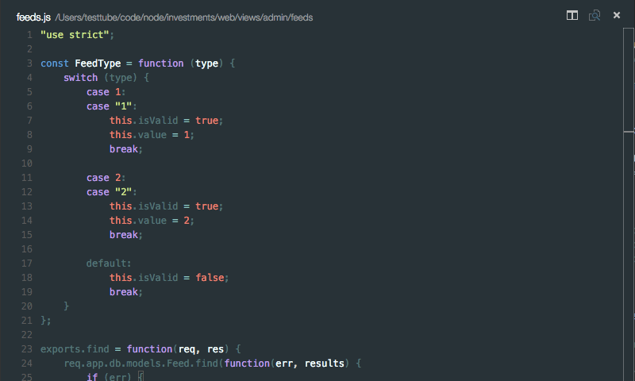

## JavaScript Complexity Analysis for Visual Studio Code

Uses [ESComplex] to produce a complexity analysis report for a JavaScript project or file. The following [metrics] can calculated:

* Lines of code
* Number of parameters
* Cyclomatic complexity
* Halstead metrics
* Maintainability


## Installation

* Install Visual Studio Code 0.10 or later.
* In the command palette (`Ctrl-Shift-P` or `Cmd-Shift-P` or `F1`) select `Install Extension` and choose `JS Complexity Analysis Report`.


## Usage

### Project analysis



Produces a per function complexity analysis report of all `.js` files in the project. `node_modules` folder is always ignored. Open command palette `F1` and search for `Project complexity analysis`.

By default project's `search.exclude` configuration is used for excluding files, but included files can be configured using include and exclude glob patterns. Select `Code` --> `Preferences` --> `User Settings` or `Workspace Settings`. For example:

```javascript
"complexityAnalysis.exclude": {
    "**/bower_components/**": true
},

"complexityAnalysis.include": {
    "**/app/**": true
}
```

### File analysis

Produces a per function complexity analysis report of currently open file. Open command palette `F1` and search for `File complexity analysis`.


## Change Log

[View](https://github.com/tomi/vscode-js-complexity-analysis/blob/master/HISTORY.md)


## Bugs

Report them [here](https://github.com/tomi/vscode-js-complexity-analysis/issues).


## Licence

[MIT](https://github.com/tomi/vscode-js-complexity-analysis)

[ESComplex]: https://github.com/jared-stilwell/escomplex
[metrics]: https://github.com/jared-stilwell/escomplex#metrics


## Acknowledgements

This project is a grateful recipient of the [Futurice Open Source sponsorship program](http://futurice.com/blog/sponsoring-free-time-open-source-activities). ♥
